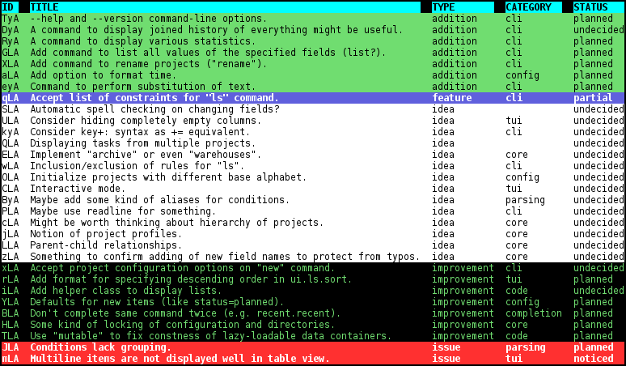

_dit_
_2015 - 2016_

**Last updated**: 22 January, 2016

**Version**: 0.9

### Brief Description ###

This is a task management application for command-line oriented people.

The idea is to provide a relatively simple tool for managing software
development tasks that is more sophisticated than simple TODO lists, but simpler
than overly complicated task management software out there.  One can spot some
similarities with git.

_NOTE_: It somewhat resembles [TaskWarrior][1] by accident, didn't see it before
starting writing this application, but TaskWarrior seems to be very powerful and
should be more popular than it is, it's just that lists or search results didn't
include it.  So the reader might want to use TaskWarrior, which seems to be more
oriented on GTD and similar techniques.

### Status ###

This is quite close to 1.0 version, although it might see some changes for the
sake of improvement, but the code itself is stable.  The application has been in
development and use since summer 2015.

### Features ###

* Non-numeric identifiers (non-decimal [Grey code][2]);
* Never forgets data (new values override the old ones, items are not removed);
* Isolated projects with local configuration;
* Aliases with argument substitution;
* Composition of aliases and commands.

### Usage ###

The out of the box setup is minimal.  One is likely to want to change some
settings add define convenient aliases.  There are no assumptions on the
workflow, which are expected to be defined by the user.

### Example ###

Commands look like:

```
d.d add title: Add install target. type: addition category: code status: in progress
```

Example of entry listing:



### Supported Environment ###

Expected to work in \*nix like environments.

### Prerequisites ###

* GNU Make;
* C++11 compatible compiler (e.g. GCC 4.9.3);
* [Boost][3], tested with 1.58 and 1.59, but somewhat older versions should work
  as well;
* (optional) pandoc for building man page.

### Interaction with Environment ###

* A bash completion script simplifies interaction with the application in a
  shell.
* The application can spawn an editor to allow easier editing.

### License ###

GNU General Public License, version 3 or later.


[1]: http://taskwarrior.org/
[2]: https://en.wikipedia.org/wiki/Grey_code
[3]: http://www.boost.org/
